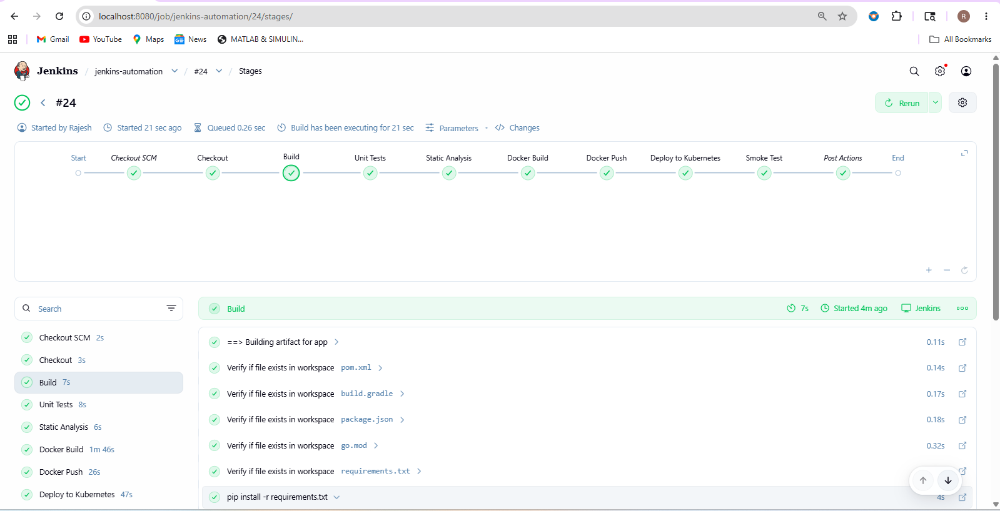

# CI/CD Pipeline — Git + Jenkins + Kubernetes

> **Submission for:** SRE Intern Problem Statement
> **Stack:** Git · Jenkins (Groovy Declarative Pipeline) · Docker · Kubernetes (k3s) · Python Flask
> Automated CI/CD pipeline that builds, tests, containerizes, and deploys a Python Flask
> application to Kubernetes on every git push — with zero manual intervention.

---

## What's Included

| File / Directory | Description |
|-----------------|-------------|
| `Jenkinsfile` | Complete declarative pipeline with 10 stages, error handling, and Slack notifications |
| `Dockerfile` | Secure multi-stage build (non-root user, minimal Python runtime image) |
| `app.py` | Python Flask application with `/`, `/health`, and `/ready` endpoints |
| `requirements.txt` | Python dependencies (Flask + Gunicorn) |
| `k8s/deployment.yaml` | Zero-downtime rolling Deployment with resource limits, liveness/readiness probes, and security context |
| `k8s/service.yaml` | Kubernetes NodePort Service exposing the Flask app |
| `jenkins/shared-library/vars/cicdUtils.groovy` | Reusable Groovy library — build detection, K8s helpers, Slack notifier |
| `monitoring/prometheus-rules.yaml` | Prometheus alerting rules for deployment health, error rate, and latency SLOs |
| `tests/test_app.py` | pytest unit tests for all Flask endpoints |
| `docs/SETUP_GUIDE.md` | Full setup guide: Jenkins plugins, credentials, k3s setup, webhook config, troubleshooting |

---

## Pipeline Flow

```
git push
   │
   ▼  (GitHub Webhook via ngrok → Generic Webhook Trigger)
Jenkins
   ├─ 1.  Checkout SCM      clone repo from GitHub
   ├─ 2.  Checkout          verify workspace and files
   ├─ 3.  Build             install Python dependencies via pip
   ├─ 4.  Unit Tests        run pytest, publish JUnit results
   ├─ 5.  Static Analysis   flake8 linting on app.py
   ├─ 6.  Docker Build      build image tagged with build number
   ├─ 7.  Docker Push       push image to Docker Hub
   ├─ 8.  Deploy (K8s)      envsubst renders templates → kubectl apply → rollout status
   ├─ 9.  Smoke Test        polls /health endpoint post-rollout
   └─ 10. Post Actions      cleanup, Slack green/red on outcome
```

Branch → environment mapping (automatic):

| Branch | Environment | Namespace |
|--------|------------|-----------|
| `main` / `master` | prod | `production` |
| `release/*` | staging | `staging` |
| everything else | dev | `dev` |

---

## Proof — Pipeline Running Successfully



---

## Required Jenkins Credentials

| Credential ID | Type | Description |
|--------------|------|-------------|
| `docker-registry-credentials` | Username/Password | Docker Hub login |
| `kubeconfig-dev` | Secret File | k3s kubeconfig (see SETUP_GUIDE.md) |
| `slack-webhook-url` | Secret Text | Slack notifications (optional) |

---

## Quick Start

```bash
# 1. Clone this repo
git clone https://github.com/Rajeswararao89/flask-ci-cd-app.git
cd flask-ci-cd-app

# 2. Follow docs/SETUP_GUIDE.md to configure Jenkins + credentials

# 3. Start ngrok to expose Jenkins to GitHub
ngrok http 8080

# 4. Register the webhook in GitHub Settings → Webhooks

# 5. Push a commit — the pipeline fires automatically
git commit -m "trigger pipeline" --allow-empty
git push origin main
```

---

## Run Tests Locally

```bash
python3 -m venv venv
source venv/bin/activate
pip install flask pytest
pytest tests/ -v
```

---

## Verify Deployment

```bash
# Check pods are running
kubectl get pods -n dev

# Get NodePort and test the app
NODE_PORT=$(kubectl get svc flask-cicd-app -n dev -o jsonpath='{.spec.ports[0].nodePort}')
curl http://localhost:$NODE_PORT/
curl http://localhost:$NODE_PORT/health
curl http://localhost:$NODE_PORT/ready
```

---

## Key Design Decisions

**Scalability** — The same Jenkinsfile serves any repository by auto-detecting the build tool via `detectBuildCommand()`. The `pipelineConfig` map supports adding new environments and clusters in one line.

**Security** — Credentials never touch the Jenkinsfile. Docker login uses `--password-stdin`. Containers run as non-root with capabilities dropped and read-only root filesystem.

**Reliability** — `disableConcurrentBuilds()` prevents deploy races. Rollout status polling catches failed deployments before the build is marked green. Smoke tests validate real traffic reaches the service.

**Observability** — Prometheus alerting rules cover the four golden signals (latency, traffic, errors, saturation). Every image is labelled with the git commit and build number for full traceability.

**Extensibility** — New tech stacks: add one entry to `detectBuildCommand()`. New clusters: add one entry to `pipelineConfig.kubeconfigCredId`. Organisation-wide logic: move helpers to the Jenkins shared library.

---

## Environment

| Component | Details |
|-----------|---------|
| OS | Ubuntu 22.04 (Vagrant VM) |
| Kubernetes | k3s v1.32 (single-node) |
| Jenkins | 2.555.2 |
| Registry | Docker Hub |
| Tunnel | ngrok (exposes Jenkins to GitHub webhooks) |
